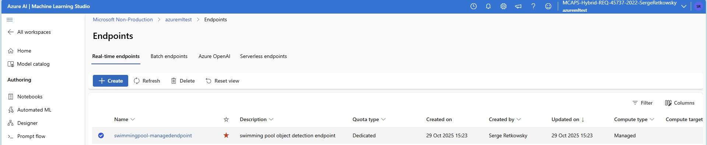

# Object Detection with Azure AutoML for Images

## Swimming pools object detection use-case


This repository contains a comprehensive, end-to-end tutorial with Python notebooks demonstrating object detection using Azure AutoML for Images. The notebooks guide you through the complete workflow from data preparation to model deployment and inference, including both cloud and edge scenarios.

## 📋 Overview
Azure AutoML for Images is a feature within Azure Machine Learning that allows you to easily and rapidly build vision models from image data. This repository focuses on Image Classification scenarios, showcasing how to leverage AutoML to generate high-quality models with minimal code.


With Azure AutoML for Images, you can:
- Automatically generate models trained on image data
- Detect and localize multiple objects within images
- Control model training parameters and hyperparameters
- Leverage state-of-the-art deep learning algorithms
- Deploy models as web services in Azure ML
- Export models to ONNX format for edge deployment
- Operationalize models at scale using Azure ML MLOps capabilities

## 🎯 What is Object Detection?

Object detection is a computer vision task that involves identifying and localizing objects within an image. Unlike image classification, which assigns a single label to an entire image, object detection identifies multiple objects and draws bounding boxes around each detected object, along with confidence scores and class labels.

## 📓 Notebooks in This Repository

This repository contains **4 sequential notebooks** that walk you through the complete object detection workflow:

### 1️⃣ Download Images Files and Labels
**Notebook**: `1 Download images files and labels.ipynb`

This notebook covers data preparation:
- Downloading image datasets
- Preparing labeled data with bounding box annotations
- Understanding the JSONL format for object detection
- Organizing your dataset for Azure ML
- Data validation and quality checks

### 2️⃣ AutoML for Object Detection
**Notebook**: `2 AutoML for Object Detection.ipynb`

This is the core training notebook:
- Configuring Azure ML workspace connection
- Setting up AutoML for object detection tasks
- Defining training parameters and compute resources
- Selecting model algorithms (Faster R-CNN, YOLO, RetinaNet, etc.)
- Hyperparameter tuning and optimization
- Training multiple models and selecting the best one
- Evaluating model performance with metrics (mAP, precision, recall)

### 3️⃣ Object Detection Model Inferencing
**Notebook**: `3 Object detection model inferencing.ipynb`

This notebook demonstrates cloud-based inference:
- Deploying the trained model to Azure ML endpoints
- Creating real-time inference endpoints
- Making predictions on new images
- Visualizing detection results with bounding boxes
- Batch inference scenarios
- Performance monitoring and logging

### 4️⃣ ONNX Edge Object Detection Model Inferencing
**Notebook**: `4 ONNX edge object detection model inferencing.ipynb`

This notebook covers edge deployment:
- Exporting models to ONNX format for edge devices
- Optimizing models for edge inference
- Running inference locally without cloud connectivity
- Deploying to IoT Edge devices
- Performance optimization for resource-constrained environments
- Integration with edge computing scenarios

## ✨ Key Features

- **Complete End-to-End Workflow**: From data preparation to production deployment
- **Cloud and Edge Deployment**: Both Azure ML endpoints and ONNX edge inference
- **Automated Model Selection**: AutoML automatically finds the best model architecture
- **Hyperparameter Tuning**: Automatic optimization of model parameters
- **Multiple Algorithms Support**: YOLO, Faster R-CNN, RetinaNet, SSD, and more
- **No Training Code Required**: Build models without writing training loops
- **Production-Ready**: Deploy as web services with MLOps support
- **ONNX Export**: Edge deployment capabilities for IoT scenarios

## 🛠️ Prerequisites

- **Azure Subscription**: An active Azure account
- **Azure Machine Learning Workspace**: A configured Azure ML workspace
- **Python Environment**: Python 3.7 or higher
- **Azure ML SDK**: Azure Machine Learning Python SDK
- **Labeled Dataset**: Images with bounding box annotations in JSONL format

## 🚀 Getting Started

Follow these steps to get started with object detection using Azure AutoML:

### Prerequisites Setup

1. **Clone the repository**:
   ```bash
   git clone https://github.com/retkowsky/object-detection-azure-automl-for-images.git
   cd object-detection-azure-automl-for-images
   ```

2. **Configure Azure ML Workspace**: Update the notebooks with your Azure ML workspace details:
   - Subscription ID
   - Resource Group
   - Workspace Name
   - Compute Cluster Name

### Sequential Workflow

Execute the notebooks in order:

1. **Start with Data Preparation** (`1 Download images files and labels.ipynb`)
   - Download and prepare your image dataset
   - Create proper annotations in JSONL format
   - Upload data to Azure ML

2. **Train Your Model** (`2 AutoML for Object Detection.ipynb`)
   - Configure AutoML experiment
   - Train multiple models
   - Evaluate and select the best model

3. **Deploy for Cloud Inference** (`3 Object detection model inferencing.ipynb`)
   - Deploy model to Azure ML endpoint
   - Test with new images
   - Visualize detection results

4. **Deploy for Edge** (`4 ONNX edge object detection model inferencing.ipynb`)
   - Export model to ONNX format
   - Run inference on edge devices
   - Optimize for resource-constrained environments

## 📊 Supported Model Algorithms

Azure AutoML for Images supports various object detection algorithms, including:

- **Faster R-CNN**
- **RetinaNet**
- **YOLO (You Only Look Once)**
- **SSD (Single Shot Detector)**
- And more...

Each algorithm has different trade-offs between speed and accuracy, and AutoML can help you find the best one for your specific use case.

## 📖 Documentation

### Azure AutoML for Images
- [Azure AutoML for Images Overview](https://docs.microsoft.com/en-us/azure/machine-learning/concept-automated-ml)
- [How to Auto-Train Image Models](https://docs.microsoft.com/en-us/azure/machine-learning/how-to-auto-train-image-models)
- [Object Detection with AutoML](https://docs.microsoft.com/en-us/azure/machine-learning/how-to-use-automl-small-object-detect)
- [Supported Model Algorithms](https://docs.microsoft.com/en-us/azure/machine-learning/how-to-auto-train-image-models#supported-model-algorithms)
- [Azure Machine Learning](https://azure.microsoft.com/en-us/services/machine-learning/)

### ONNX and Edge Deployment
- [ONNX Inference for AutoML Image Models](https://docs.microsoft.com/en-us/azure/machine-learning/how-to-inference-onnx-automl-image-models)
- [Deploy Models to IoT Edge](https://docs.microsoft.com/en-us/azure/machine-learning/how-to-deploy-and-where)
- [ONNX Runtime Documentation](https://onnxruntime.ai/)
- [Azure IoT Edge](https://azure.microsoft.com/en-us/services/iot-edge/)

## 📁 Repository Structure

```
object-detection-azure-automl-for-images/
│
├── 1 Download images files and labels.ipynb
│   └── Data preparation and dataset setup
│
├── 2 AutoML for Object Detection.ipynb
│   └── Model training with Azure AutoML
│
├── 3 Object detection model inferencing.ipynb
│   └── Cloud deployment and inference
│
├── 4 ONNX edge object detection model inferencing.ipynb
│   └── Edge deployment with ONNX
│
└── README.md
    └── This file
```

## 🔧 Hyperparameter Tuning

AutoML for Images allows you to sweep hyperparameters to optimize model performance. Key parameters include:

- **Learning Rate**: Controls the step size during training
- **Batch Size**: Number of images processed in each iteration
- **Number of Epochs**: Training duration
- **Box Score Threshold**: Minimum confidence score for object proposals
- **IOU Threshold**: Intersection over Union threshold for non-maximum suppression

## 🎓 Complete Workflow

This repository guides you through the complete workflow with dedicated notebooks:

### Phase 1: Data Preparation (Notebook 1)
1. **Download Dataset**: Acquire images and annotations
2. **Data Validation**: Verify image quality and label accuracy
3. **Format Conversion**: Convert annotations to JSONL format
4. **Azure ML Upload**: Upload dataset to Azure ML datastore

### Phase 2: Model Training (Notebook 2)
5. **Configure AutoML**: Set up training parameters and compute
6. **Select Algorithms**: Choose object detection algorithms to try
7. **Hyperparameter Tuning**: Optimize model parameters automatically
8. **Model Training**: Train multiple models in parallel
9. **Model Evaluation**: Compare models using mAP, precision, and recall
10. **Select Best Model**: Identify the optimal model for deployment

### Phase 3: Cloud Deployment (Notebook 3)
11. **Model Registration**: Register the best model in Azure ML
12. **Create Endpoint**: Deploy as a real-time inference endpoint
13. **Test Predictions**: Send test images for inference
14. **Visualize Results**: Display bounding boxes and confidence scores
15. **Production Monitoring**: Track performance and logs

### Phase 4: Edge Deployment (Notebook 4)
16. **ONNX Export**: Convert model to ONNX format
17. **Model Optimization**: Optimize for edge hardware
18. **Local Testing**: Run inference without cloud connection
19. **Edge Deployment**: Deploy to IoT devices or edge servers
20. **Performance Tuning**: Optimize for latency and resource usage

## ⚙️ Configuration Example

```python
from azure.ai.ml import automl

# Configure object detection job
image_object_detection_job = automl.image_object_detection(
    compute="your-compute-cluster",
    experiment_name="object-detection-experiment",
    training_data=training_data,
    validation_data=validation_data,
    target_column_name="label",
    primary_metric="mean_average_precision",
    tags={"project": "object-detection"}
)

# Set training parameters
image_object_detection_job.set_limits(
    timeout_minutes=60,
    max_trials=10,
    max_concurrent_trials=4
)
```

## 📈 Evaluation Metrics

Object detection models are evaluated using metrics such as:

- **mAP (mean Average Precision)**: Primary metric for object detection
- **Precision**: Proportion of correct positive predictions
- **Recall**: Proportion of actual positives correctly identified
- **IoU (Intersection over Union)**: Overlap between predicted and ground truth boxes

## 🚀 Deployment

This repository covers both cloud and edge deployment scenarios:

### Cloud Deployment (Notebook 3)
- **Azure ML Online Endpoints**: Real-time inference with auto-scaling

### Edge Deployment (Notebook 4)
- **ONNX Runtime**: Optimized cross-platform inference
- **IoT Edge Devices**: Deploy to edge computing devices
- **Local Inference**: Run without cloud connectivity
- **Mobile Devices**: Deploy to iOS/Android applications
- **Embedded Systems**: Run on resource-constrained hardware

### Benefits of ONNX Edge Deployment
- **Lower Latency**: Process images locally without network calls
- **Reduced Costs**: No per-prediction cloud inference costs
- **Offline Capability**: Work without internet connection
- **Privacy**: Keep sensitive data on-device
- **Scalability**: Distribute processing across many edge devices

## ⚠️ Important Notes

- All notebooks in this repository are created for **demonstration and educational purposes**
- These notebooks are **not designed for production usage** without proper testing, validation, and security reviews
- **Execute notebooks sequentially** (1 → 2 → 3 → 4) for the complete workflow
- AutoML for Images capabilities may have evolved - always refer to the latest Azure documentation
- Ensure you have appropriate compute resources allocated in your Azure ML workspace
- Edge deployment (Notebook 4) requires ONNX Runtime to be installed on target devices
- Monitor costs associated with compute, storage, and inference endpoints

## 💡 Use Cases and Applications

This object detection workflow can be applied to numerous real-world scenarios:

- **Retail**: Product detection, shelf monitoring, inventory management
- **Manufacturing**: Defect detection, quality control, parts identification
- **Safety**: PPE detection (hard hats, safety vests, goggles)
- **Agriculture**: Crop disease detection, fruit counting, pest identification
- **Healthcare**: Medical imaging, cell detection, pathology analysis
- **Transportation**: Vehicle detection, license plate recognition, traffic monitoring
- **Security**: Surveillance, intrusion detection, perimeter monitoring
- **Infrastructure**: Crack detection, damage assessment, maintenance inspection

## Screenshots

### Images


### GPU compute cluster


### Model training


### Best model


### Deployed model



### Webapp


## 📧 Contact

**Serge Retkowsky**
- Email: serge.retkowsky@microsoft.com
- LinkedIn: https://www.linkedin.com/in/serger/
- Updated: 30th of october, 2025

## 📄 License

This project is provided as-is for educational and demonstration purposes.

---

**Note**: This repository demonstrates Azure AutoML for Images capabilities. For the latest features and updates, please refer to the [official Azure Machine Learning documentation](https://docs.microsoft.com/en-us/azure/machine-learning/).

**Last Updated**: October 2025
